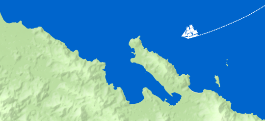
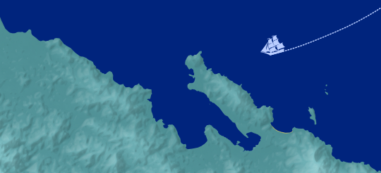
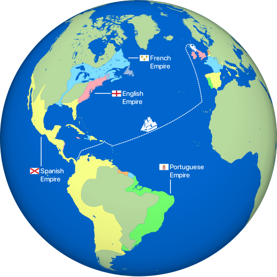
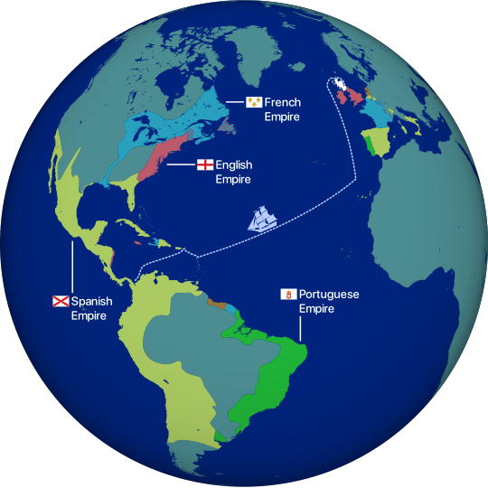
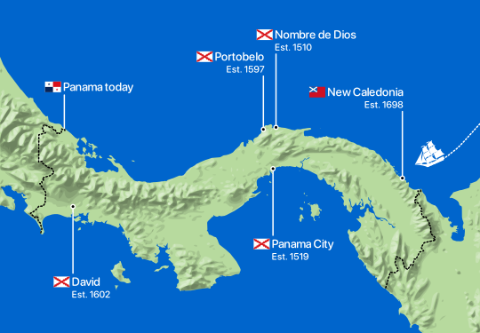
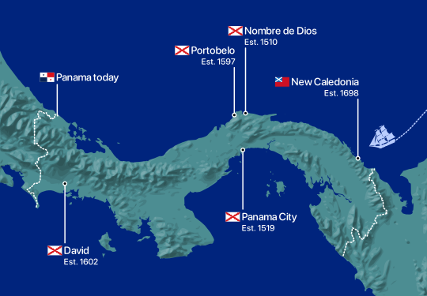
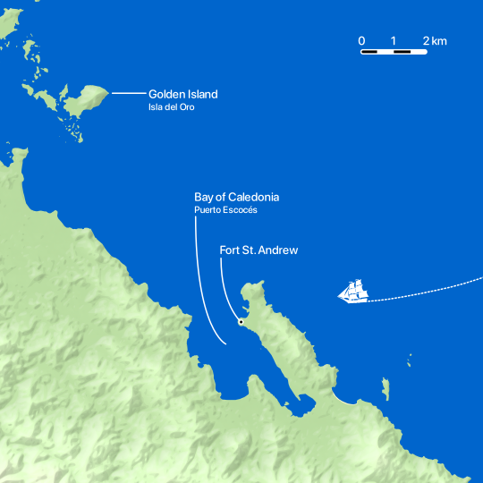
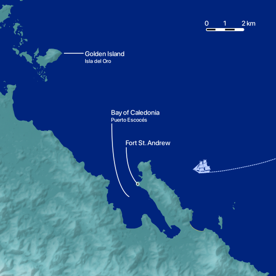

# new-caledonia-maps

This repository contains code used to generate the graphics for the post [_Mapping the Scottish Colony 'New Caledonia'_](http://leifgehrmann.com/2023/04/02/mapping-new-caledonia/). 

## Output

| Map        | Light                           | Dark                           |
|------------|---------------------------------|--------------------------------|
| `preview`  |   |   |
| `world`    |     |     |
| `panama`   |    |    |
| `overview` |  |  |

## Map data

Data is downloaded from:

* NaturalEarthData.com, for coastline and hillshade data,
* OpenStreetMap, for coastline data near New Caledonia,
* USGS.gov for SRTM/elevation data.

**Note:** An account is required to download data from USGS.gov's data-explorer. 

```commandline
make download-new-data
make download-osm-data
make download-srtm-data
```

## Installing software dependencies

Please install:

* Docker
* Python
* Poetry: https://python-poetry.org

Then run:

```commandline
make install
make build
```

## Generating graphics

First the hillshade graphics need to be created by running:

```commandline
make preview-hillshade
make panama-hillshade
make overview-hillshade
```

Warnings are expected when the scripts are run, and may take several seconds to complete.

Then the final composition can be created by running:

```commandline
make preview
make world
make panama
make overview
```

**Note:** This project assumes certain fonts are installed – fonts that are only available on macOS.
So if you are running this on a different operating system, you may get different results.
